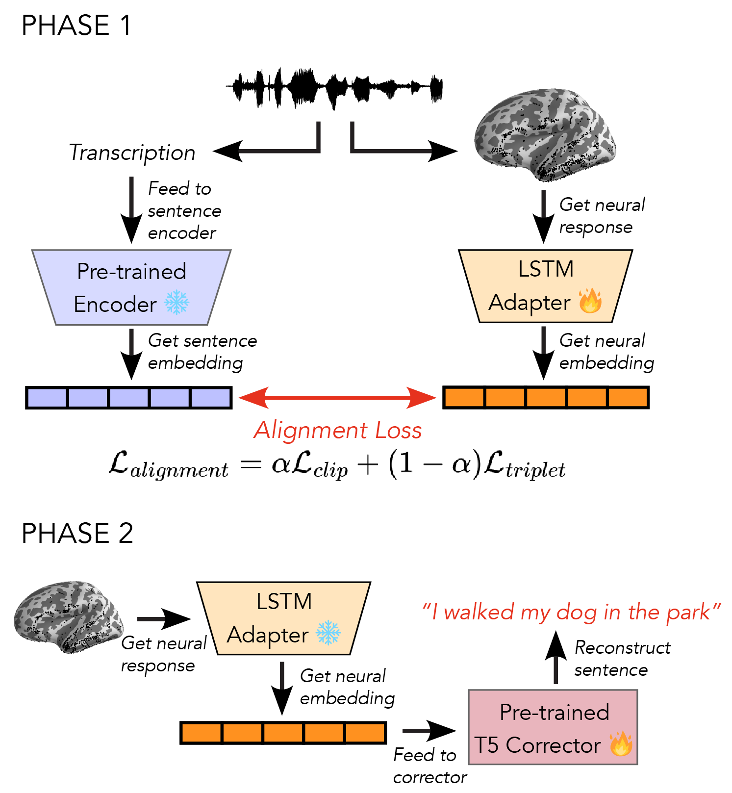

# 🚧 Under Construction 🚧

# Neuro2Semantic 🧠➡️💬

*A transfer‑learning framework for semantic reconstruction of continuous language from human intracranial EEG (iEEG)*

> **TL;DR** Neuro2Semantic aligns high‑gamma iEEG recordings with large‑scale text‑embedding spaces and then inverts those embeddings to fluent sentences with Vec2Text, achieving competitive performance with **≈ 30 min** of neural data per participant.

---


## Table of Contents

1. [Paper](#paper)
2. [Data](#data)
3. [Training & Evaluation](#training--evaluation)
4. [Results](#results)
5. [Citation](#citation)
6. [Acknowledgements](#acknowledgements)

---

## Paper

[](https://arxiv.org/abs/2506.00381)

*Neuro2Semantic: A Transfer Learning Framework for Semantic Reconstruction of Continuous Language from Human Intracranial EEG.* Interspeech 2025.
**Siavash Shams, Richard Antonello, Gavin Mischler, Stephan Bickel, Ashesh Mehta & Nima Mesgarani**



---

## Data

We provide a **synthetic dataset** to illustrate the expected format and structure of real iEEG recordings used in this project. This data is **not real neural data**, but generated for demonstration and debugging purposes only.

* The file `synthetic_data.pkl` contains

  * word‑ and phoneme‑aligned text transcripts
  * neural recordings across multiple frequency bands (`delta`, `highgamma`, etc.)
  * subject and electrode metadata
  * example mappings for phonemes, words, and articulatory features

Each entry follows the same structure we use for real patient data.

📄 **[Full schema & examples → synthetic\_data/README.md](synthetic_data/README.md)**

> ⚠️ Due to patient‑privacy regulations we cannot publish the real neural recordings. Researchers may request access to pre‑processed embedding‑level data by contacting the authors.

---

## Training & Evaluation

* **Full sweep:** `bash submit_jobs.sh` (Slurm cluster)
* **Metrics logged:** loss, cosine similarity, BLEU, BERTScore, ROUGE
* **Embeddings saved:** every 10 epochs to `embeddings/`

---

## Results

| Setting                     | BLEU ↑            | BERTScore F1 ↑    |
| --------------------------- | ----------------- | ----------------- |
| **Neuro2Semantic**          | **0.079 ± 0.062** | **0.195 ± 0.128** |
| Tang et al. (fMRI baseline) | 0.064 ± 0.053     | 0.032 ± 0.127     |
| Random                      | 0.002 ± 0.003     | –0.245 ± 0.132    |


---

## Citation

If you build on this work, please cite:

```bibtex
@misc{shams2025neuro2semantictransferlearningframework,
      title={Neuro2Semantic: A Transfer Learning Framework for Semantic Reconstruction of Continuous Language from Human Intracranial EEG}, 
      author={Siavash Shams and Richard Antonello and Gavin Mischler and Stephan Bickel and Ashesh Mehta and Nima Mesgarani},
      year={2025},
      eprint={2506.00381},
      archivePrefix={arXiv},
      primaryClass={cs.CL},
      url={https://arxiv.org/abs/2506.00381}, 
}
```

---

## Acknowledgements

We thank the participating patients, and the Vec2Text authors for open‑sourcing their inversion framework. Support from NIH \[NIDCD], Marie-Josee and Henry R. Kravis, and the Feinstein Institutes is gratefully acknowledged.

*Happy decoding!* 🎧📝
